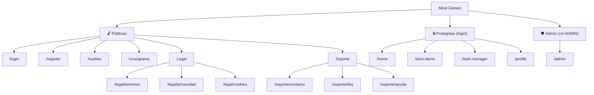

# Frontend

This project was generated using [Angular CLI](https://github.com/angular/angular-cli) version 21.1.2.

## Árbol / Sitemap de la página web

Estructura de páginas (rutas) de la aplicación, tal como está definida en
[`src/app/app.routes.ts`](src/app/app.routes.ts). Todas las páginas comparten el mismo
`Navbar` y `Footer` globales (ver `src/app/app.ts`), excepto `/login` y `/register`, donde
ambos se ocultan.

```
Mind Games (SPA - Angular Router)
│
├── 🔓 Públicas (sin sesión)
│   ├── /login                 → Iniciar sesión (2FA opcional vía correo)
│   ├── /register               → Registro de nuevo usuario
│   ├── /sudoku                  → Juego: Sudoku
│   ├── /crucigrama                → Juego: Crucigrama
│   │
│   ├── /legal/terminos              → Términos y Condiciones
│   ├── /legal/privacidad              → Política de Privacidad
│   ├── /legal/cookies                   → Política de Cookies
│   │
│   ├── /soporte/contacto                  → Contacto (teléfono / correo)
│   ├── /soporte/faq                         → Preguntas Frecuentes
│   └── /soporte/ayuda                         → Ayuda y Soporte (formulario → BD)
│
├── 🔒 Protegidas (requieren sesión iniciada)
│   ├── /home                  → Inicio: buscador (juegos / Wikipedia) + catálogo de juegos
│   ├── /dom-demo                → Demo de manipulación del DOM
│   ├── /task-manager               → Administrador de tareas
│   └── /profile                      → Perfil del usuario (editar datos / contraseña)
│
└── 🛡️ Administración (requieren sesión + rol ADMIN)
    └── /admin                 → Panel: gestión de usuarios, roles, estado y bitácora
```



## Development server

To start a local development server, run:

```bash
ng serve
```

Once the server is running, open your browser and navigate to `http://localhost:4200/`. The application will automatically reload whenever you modify any of the source files.

## Code scaffolding

Angular CLI includes powerful code scaffolding tools. To generate a new component, run:

```bash
ng generate component component-name
```

For a complete list of available schematics (such as `components`, `directives`, or `pipes`), run:

```bash
ng generate --help
```

## Building

To build the project run:

```bash
ng build
```

This will compile your project and store the build artifacts in the `dist/` directory. By default, the production build optimizes your application for performance and speed.

## Running unit tests

To execute unit tests with the [Vitest](https://vitest.dev/) test runner, use the following command:

```bash
ng test
```

## Running end-to-end tests

For end-to-end (e2e) testing, run:

```bash
ng e2e
```

Angular CLI does not come with an end-to-end testing framework by default. You can choose one that suits your needs.

## Additional Resources

For more information on using the Angular CLI, including detailed command references, visit the [Angular CLI Overview and Command Reference](https://angular.dev/tools/cli) page.
